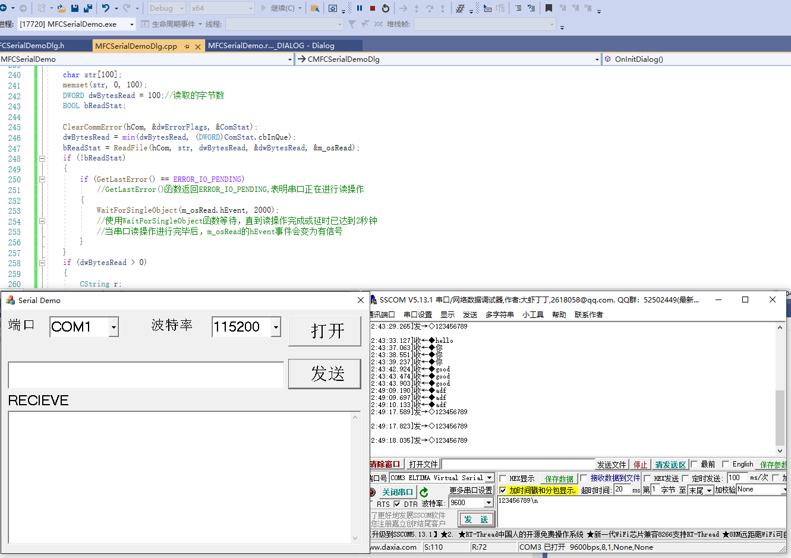

# MFCSerialDemo
mfc serial demo using windows api



#### Core Source Code

global vars

```c++
OVERLAPPED m_osWrite;
OVERLAPPED m_osRead;
HANDLE hCom;  //全局变量，串口句柄
```


open com

```c++
	hCom = CreateFile(_T("COM2"), //change to your port
		GENERIC_READ | GENERIC_WRITE,
		0,
		NULL,
		OPEN_EXISTING,
		FILE_ATTRIBUTE_NORMAL | FILE_FLAG_OVERLAPPED, //
		NULL);
	if (hCom == INVALID_HANDLE_VALUE)
	{
		AfxMessageBox(_T("打开COM失败!"));
	}
	SetupComm(hCom, 100, 100);

	COMMTIMEOUTS TimeOuts;
	//设定读超时
	TimeOuts.ReadIntervalTimeout = 1000;
	TimeOuts.ReadTotalTimeoutMultiplier = 500;
	TimeOuts.ReadTotalTimeoutConstant = 5000;
	//设定写超时
	TimeOuts.WriteTotalTimeoutMultiplier = 500;
	TimeOuts.WriteTotalTimeoutConstant = 2000;
	SetCommTimeouts(hCom, &TimeOuts); //设置超时

	DCB dcb;
	GetCommState(hCom, &dcb);
	dcb.BaudRate = 9600; //波特率为9600
	dcb.ByteSize = 8; 
	dcb.Parity = NOPARITY;
	dcb.StopBits = ONESTOPBIT;
	SetCommState(hCom, &dcb);

	PurgeComm(hCom, PURGE_TXCLEAR | PURGE_RXCLEAR);
	SetTimer(1, 10, NULL); //10 ms check
	memset(&m_osRead, 0, sizeof(OVERLAPPED));
	m_osRead.hEvent = CreateEvent(NULL, TRUE, FALSE, NULL);
```

button send code

```c++
	DWORD dwBytesWrite = 0;
	COMSTAT ComStat;
	DWORD dwErrorFlags;
	BOOL bWriteStat;
	ClearCommError(hCom, &dwErrorFlags, &ComStat);
	memset(&m_osWrite, 0, sizeof(OVERLAPPED));
	m_osWrite.hEvent = CreateEvent(NULL, TRUE, FALSE, NULL);
	CString input;
	GetDlgItem(IDC_EDIT1)->GetWindowTextW(input);
	char buf[100] = { 0 };
	WideCharToMultiByte(CP_OEMCP, NULL, input, -1, buf, input.GetLength(), NULL, FALSE);
	bWriteStat = WriteFile(hCom, buf, input.GetLength(), &dwBytesWrite, &m_osWrite);
	if (!bWriteStat)
	{
		if (GetLastError() == ERROR_IO_PENDING)
		{
			WaitForSingleObject(m_osWrite.hEvent, 1000);
		}
		return;
	}
	PurgeComm(hCom, PURGE_TXABORT | PURGE_RXABORT | PURGE_TXCLEAR | PURGE_RXCLEAR);
```

recieved code

```c++
void CMFCSerialDemoDlg::OnTimer(UINT_PTR nIDEvent)
{
	// TODO: 在此添加消息处理程序代码和/或调用默认值
	switch (nIDEvent)
	{
	case 1:
		read_serial();
		break;
	}
	CDialogEx::OnTimer(nIDEvent);
}
int CMFCSerialDemoDlg::read_serial()
{
	// TODO: 在此处添加实现代码.
	COMSTAT ComStat;
	DWORD dwErrorFlags;

	char str[100];
	memset(str, 0, 100);
	DWORD dwBytesRead = 0;//读取的字节数
	BOOL bReadStat;

	ClearCommError(hCom, &dwErrorFlags, &ComStat);
	dwBytesRead = min(dwBytesRead, (DWORD)ComStat.cbInQue);
	bReadStat = ReadFile(hCom, str, dwBytesRead, &dwBytesRead, &m_osRead);
	if (!bReadStat)
	{
		if (GetLastError() == ERROR_IO_PENDING)
		{
			WaitForSingleObject(m_osRead.hEvent, 2000);
		}
	}
	if (dwBytesRead > 0)
	{
		CString r;
		GetDlgItem(IDC_EDIT2)->GetWindowTextW(r);
		CStringW s = r + "\r\n";
		s += CA2W(str);
		GetDlgItem(IDC_EDIT2)->SetWindowTextW(s);
		UpdateData(FALSE);
	}
	PurgeComm(hCom, PURGE_TXABORT | PURGE_RXABORT | PURGE_TXCLEAR | PURGE_RXCLEAR);

	return 0;
}

```

